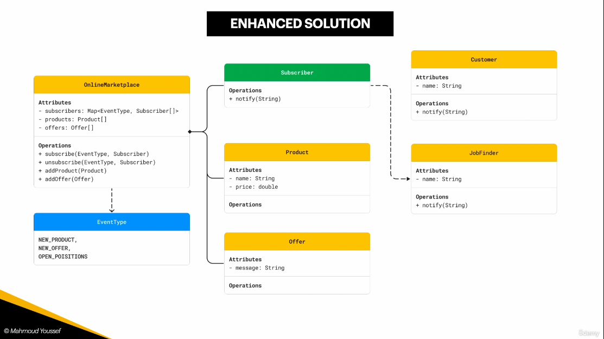
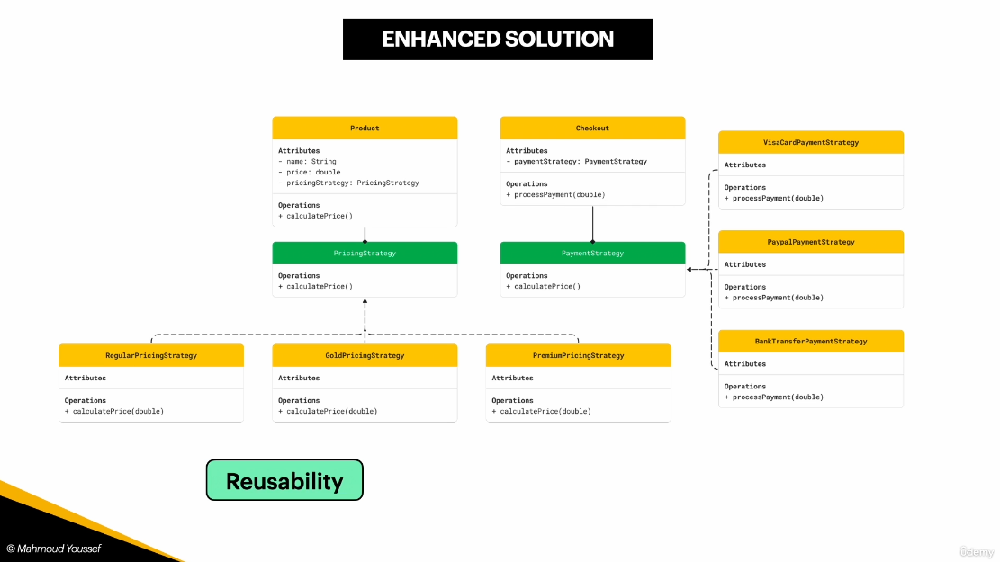
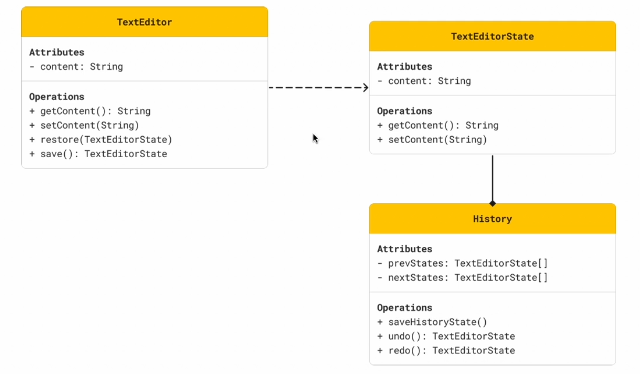

# Ultimate DEsign Patterns

this is summary of the course

# SOLID

very awesome guidline principles

## Single Responsibility principle

**_a class has only one reason to change_**

I personaly think this term is better than "A class only do one thing" because Design patterns's major advantage is to ease refactoring; so the term "_one reason to change_" comes from the fact that when I refactor I will only change that exact part

In case of violation; I will when refactoring I will have to change manythings because the class now manages alot of state and is very vulnerable to high coupling of methods even if they are separated

As long as many functionalities live within the class scope; it becomes violation, no matter if they are in separated methods or not

### TS example

this is violation

```ts
class UserService {
  createUser(name: string, email: string): void {
    console.log(`User ${name} created.`);

    this.sendEmail(email, "Welcome!", "Thank you for signing up!");
    this.logActivity(name, "User account created.");
  }

  private sendEmail(to: string, subject: string, body: string): void {
    console.log(`Sending email to ${to}: ${subject} - ${body}`);
  }

  private logActivity(user: string, action: string): void {
    console.log(`Logging activity: ${user} - ${action}`);
  }
}

const userService = new UserService();
userService.createUser("Alice", "alice@example.com");
```

this is application

```ts
class EmailService {
  sendEmail(to: string, subject: string, body: string): void {
    console.log(`Sending email to ${to}: ${subject} - ${body}`);
  }
}

class LoggerService {
  logActivity(user: string, action: string): void {
    console.log(`Logging activity: ${user} - ${action}`);
  }
}

class UserService {
  constructor(
    private emailService: EmailService,
    private loggerService: LoggerService
  ) {}

  createUser(name: string, email: string): void {
    console.log(`User ${name} created.`);

    this.emailService.sendEmail(email, "Welcome!", "Thank you for signing up!");
    this.loggerService.logActivity(name, "User account created.");
  }
}

// Usage
const emailService = new EmailService();
const loggerService = new LoggerService();
const userService = new UserService(emailService, loggerService);

userService.createUser("Alice", "alice@example.com");
```

## Open Closed principle

**_Open for adding; Closed for modifications_**

the Idea is: when we refactor the code, we don't need to refactor anything, we just add the desired functionaliy seamlessly

this is better demonstrated with an example

### example

the violation

```ts
class PaymentProcessor {
  processPayment(method: string, amount: number): void {
    if (method === "credit_card") {
      console.log(`Processing credit card payment of $${amount}`);
    } else if (method === "paypal") {
      console.log(`Processing PayPal payment of $${amount}`);
    } else {
      console.log("Unknown payment method");
    }
  }
}

// Usage
const processor = new PaymentProcessor();
processor.processPayment("credit_card", 100);
processor.processPayment("paypal", 50);
```

the application

```ts
interface PaymentMethod {
  process(amount: number): void;
}

class CreditCardPayment implements PaymentMethod {
  process(amount: number): void {
    console.log(`Processing credit card payment of $${amount}`);
  }
}

class PayPalPayment implements PaymentMethod {
  process(amount: number): void {
    console.log(`Processing PayPal payment of $${amount}`);
  }
}

// New payment method added without modifying existing code
class BitcoinPayment implements PaymentMethod {
  process(amount: number): void {
    console.log(`Processing Bitcoin payment of $${amount}`);
  }
}

class PaymentProcessor {
  processPayment(method: PaymentMethod, amount: number): void {
    method.process(amount);
  }
}

// Usage
const processor = new PaymentProcessor();

const creditCard = new CreditCardPayment();
const paypal = new PayPalPayment();
const bitcoin = new BitcoinPayment(); // New method added without modifying `PaymentProcessor`

processor.processPayment(creditCard, 100);
processor.processPayment(paypal, 50);
processor.processPayment(bitcoin, 200);
```

## Liskov substitution

**Parent class can Be replaced by Child class**

### examples

violation

```ts
class Bird {
  fly(): void {
    console.log("Flying...");
  }
}

class Sparrow extends Bird {}

class Penguin extends Bird {
  fly(): void {
    throw new Error("Penguins cannot fly!");
  }
}

// Usage
function makeBirdFly(bird: Bird) {
  bird.fly();
}

const sparrow = new Sparrow();
const penguin = new Penguin();

makeBirdFly(sparrow); //  Works fine
makeBirdFly(penguin); //  Throws an error: "Penguins cannot fly!"
```

application

```ts
class Bird {
  eat(): void {
    console.log("Eating...");
  }
}

class FlyingBird extends Bird {
  fly(): void {
    console.log("Flying...");
  }
}

class Sparrow extends FlyingBird {}

class Penguin extends Bird {
  swim(): void {
    console.log("Penguin is swimming.");
  }
}

// Usage
function makeBirdFly(bird: FlyingBird) {
  bird.fly();
}

const sparrow = new Sparrow();
const penguin = new Penguin();

makeBirdFly(sparrow); //  Works fine
// makeBirdFly(penguin);  Type error: Argument of type 'Penguin' is not assignable to parameter of type 'FlyingBird'.
```

## Interface segregation

**_Classes should not implement or use interfaces that has members that are not used_**

fixing this problem is by breaking the interface into smaller interfaces and only working with interfaces that makes sense

> also the term _Interface_ may be an abstract

### examples

violation

```ts
interface Worker {
  work(): void;
  takeBreak(): void;
}

class HumanWorker implements Worker {
  work(): void {
    console.log("Human is working...");
  }

  takeBreak(): void {
    console.log("Human is taking a break...");
  }
}

class RobotWorker implements Worker {
  work(): void {
    console.log("Robot is working...");
  }

  takeBreak(): void {
    throw new Error("Robots do not take breaks!");
  }
}

// Usage
const workers: Worker[] = [new HumanWorker(), new RobotWorker()];

workers.forEach((worker) => {
  worker.work();
  worker.takeBreak(); // Causes an error for RobotWorker
});
```

application

```ts
interface Workable {
  work(): void;
}

interface Breakable {
  takeBreak(): void;
}

class HumanWorker implements Workable, Breakable {
  work(): void {
    console.log("Human is working...");
  }

  takeBreak(): void {
    console.log("Human is taking a break...");
  }
}

class RobotWorker implements Workable {
  work(): void {
    console.log("Robot is working...");
  }
}

// Usage
const workers: Workable[] = [new HumanWorker(), new RobotWorker()];
workers.forEach((worker) => worker.work()); // No issue

const breakableWorkers: Breakable[] = [new HumanWorker()];
breakableWorkers.forEach((worker) => worker.takeBreak()); // Only humans take breaks
```

## Dependency inversion

**_High level (users) modules should not depend on the abstraction (implementation) but they should depend on the interface_**

then the _Low level modules_ are **injected** into the _High level modules_ and that is **Dependecy injection**

### examples

violation

```ts
class PayPalPayment {
  processPayment(amount: number): void {
    console.log(`Processing PayPal payment of $${amount}`);
  }
}

class OrderService {
  private paymentProcessor = new PayPalPayment(); // Direct dependency

  placeOrder(amount: number): void {
    console.log("Order placed.");
    this.paymentProcessor.processPayment(amount);
  }
}

// Usage
const orderService = new OrderService();
orderService.placeOrder(100);
```

application

```ts
interface PaymentProcessor {
  processPayment(amount: number): void;
}

class PayPalPayment implements PaymentProcessor {
  processPayment(amount: number): void {
    console.log(`Processing PayPal payment of $${amount}`);
  }
}

class CreditCardPayment implements PaymentProcessor {
  processPayment(amount: number): void {
    console.log(`Processing Credit Card payment of $${amount}`);
  }
}

class OrderService {
  constructor(private paymentProcessor: PaymentProcessor) {} // Inject dependency

  placeOrder(amount: number): void {
    console.log("Order placed.");
    this.paymentProcessor.processPayment(amount);
  }
}

// Usage
const paypal = new PayPalPayment();
const orderService1 = new OrderService(paypal);
orderService1.placeOrder(100);

const creditCard = new CreditCardPayment();
const orderService2 = new OrderService(creditCard);
orderService2.placeOrder(200);
```

# UML


# Observer

It is about having an **Observabls** (emailService) that notifies **Observers** (User) with events that the **Observers** has subscribed to

```ts
interface Observable {
  subscribe(observer: ObserverInterface, eventType: string): void;
  unSubscribe(observer: ObserverInterface, eventType: string): void;
  notify(event: EventInterface): void;
}
```

```ts
interface ObserverInterface {
  notify(event: EventInterface): void;
}
```

also who carries the events list is debatable

- If the Users carries the events then the EmailService will itirate over millions of users that could be not subscribing to any avents at all

- If the EmailService carries the events attached to lists of users then it will not itirate over millions of users but eventualy will carry millions of rours of users pointers and events

the approach of the course:


## Implementation

### defining interfaces

```ts
interface EventInterface {
  name: string;
  payload?: any; // Additional event data
}
```

```ts
interface ObservableInterface {
  attach(observer: ObserverInterface, eventType: string): void;
  detach(observer: ObserverInterface, eventType: string): void;
  notify(event: EventInterface): void;
}
```

```ts
interface ObserverInterface {
  update(event: EventInterface): void;
}
```

### defining classes

```ts
// Observer (User)
class User implements ObserverInterface {
  constructor(public name: string) {}

  update(event: EventInterface) {
    console.log(
      `User ${this.name} received notification: ${event.name}`,
      event.payload
    );
  }
}
```

```ts
// Notification Service with Event-Based Subscription Management
class NotificationService implements ObservableInterface {
  private observers: Map<string, Set<ObserverInterface>> = new Map();

  attach(observer: ObserverInterface, eventType: string) {
    if (!this.observers.has(eventType)) {
      this.observers.set(eventType, new Set());
    }
    this.observers.get(eventType)!.add(observer);
    console.log(
      `${(observer as User).name} subscribed to ${eventType} notifications.`
    );
  }

  detach(observer: ObserverInterface, eventType: string) {
    if (this.observers.has(eventType)) {
      this.observers.get(eventType)!.delete(observer);
      console.log(
        `${
          (observer as User).name
        } unsubscribed from ${eventType} notifications.`
      );
      if (this.observers.get(eventType)!.size === 0) {
        this.observers.delete(eventType);
      }
    }
  }

  notify(event: EventInterface) {
    if (this.observers.has(event.name)) {
      this.observers
        .get(event.name)!
        .forEach((observer) => observer.update(event));
    }
  }
}
```

```ts
// User Service (Handles user subscriptions and unsubscriptions)
class UserService {
  private users: User[] = [];

  constructor(private notificationService: NotificationService) {}

  createUser(name: string): User {
    const user = new User(name);
    this.users.push(user);
    return user;
  }

  subscribeUserToEvent(user: User, eventType: string) {
    this.notificationService.attach(user, eventType);
  }

  unsubscribeUserFromEvent(user: User, eventType: string) {
    this.notificationService.detach(user, eventType);
  }
}
```

```ts
// Email Service (Triggers email-related events)
class EmailService {
  constructor(private notificationService: NotificationService) {}

  sendEmail(emailContent: string) {
    this.notificationService.notify({ name: "email", payload: emailContent });
  }
}
```

```ts
// SMS Service (Another example observer service)
class SMSService {
  constructor(private notificationService: NotificationService) {}

  sendSMS(smsContent: string) {
    this.notificationService.notify({ name: "sms", payload: smsContent });
  }
}
```

usage

```ts
const notificationService = new NotificationService();
const userService = new UserService(notificationService);
const emailService = new EmailService(notificationService);
const smsService = new SMSService(notificationService);

// Creating Users
const user1 = userService.createUser("Alice");
const user2 = userService.createUser("Bob");

// Subscribing Users to Specific Events
userService.subscribeUserToEvent(user1, "email");
userService.subscribeUserToEvent(user2, "sms");

// Sending Notifications
emailService.sendEmail("New promotional email!");
smsService.sendSMS("Flash Sale: 50% off!");

// Unsubscribing Bob from SMS notifications
userService.unsubscribeUserFromEvent(user2, "sms");

// Sending More Notifications
emailService.sendEmail("Exclusive email offer!");
smsService.sendSMS("New SMS campaign launched!");
```

# Strategy

If a class has a composition relatioship with an interface, instead of linking them with hard coding, we can inject the implementation

it is exactly what we did in the DI pronciple



we can have unlimited implementation of the same strategy

## Implementaion

Defines a common interface for different pricing strategies.

```typescript
interface PricingStrategy {
  calculatePrice(price: number): number;
}
```

Different pricing strategies implementing `PricingStrategy`.

```typescript
class RegularPricingStrategy implements PricingStrategy {
  calculatePrice(price: number): number {
    return price; // No discount
  }
}

class GoldPricingStrategy implements PricingStrategy {
  calculatePrice(price: number): number {
    return price * 0.9; // 10% discount
  }
}

class PremiumPricingStrategy implements PricingStrategy {
  calculatePrice(price: number): number {
    return price * 0.8; // 20% discount
  }
}
```

Represents a product that uses a pricing strategy to determine its final price.

```typescript
class Product {
  constructor(
    public name: string,
    public price: number,
    private pricingStrategy: PricingStrategy
  ) {}

  calculatePrice(): number {
    return this.pricingStrategy.calculatePrice(this.price);
  }
}
```

Defines a common interface for different payment strategies.

```typescript
interface PaymentStrategy {
  processPayment(amount: number): void;
}
```

Different payment strategies implementing `PaymentStrategy`.

```typescript
class VisaCardPaymentStrategy implements PaymentStrategy {
  processPayment(amount: number): void {
    console.log(`Processing Visa Card payment of $${amount}`);
  }
}

class PaypalPaymentStrategy implements PaymentStrategy {
  processPayment(amount: number): void {
    console.log(`Processing PayPal payment of $${amount}`);
  }
}

class BankTransferPaymentStrategy implements PaymentStrategy {
  processPayment(amount: number): void {
    console.log(`Processing Bank Transfer payment of $${amount}`);
  }
}
```

Handles payment processing using a selected payment strategy.

```typescript
class Checkout {
  constructor(private paymentStrategy: PaymentStrategy) {}

  processPayment(amount: number): void {
    this.paymentStrategy.processPayment(amount);
  }
}
```

Demonstrates how to use the strategies in action.

```typescript
// Create a product with a Gold pricing strategy
const product1 = new Product("Laptop", 1000, new GoldPricingStrategy());

// Calculate the final price
console.log(`Final Price: $${product1.calculatePrice()}`);

// Process payment using PayPal
const checkout = new Checkout(new PaypalPaymentStrategy());
checkout.processPayment(product1.calculatePrice());
```

# Template Method

The **Template Method** design pattern defines the **skeleton of an algorithm** in a base class but lets subclasses **override specific steps** without changing the algorithm's structure.

Here’s a **TypeScript implementation** using Markdown under `## Implementation`.

## Implementation

Defines the template method and the structure of the algorithm.

```typescript
abstract class OrderProcessor {
  // Template method (final method that defines the process)
  processOrder(): void {
    this.selectProduct();
    this.makePayment();
    this.deliverProduct();
  }

  abstract selectProduct(): void;
  abstract makePayment(): void;

  // Hook method (optional step with default implementation)
  deliverProduct(): void {
    console.log("Delivering product to customer...");
  }
}
```

Subclasses implement specific steps of the algorithm.

```typescript
class OnlineOrderProcessor extends OrderProcessor {
  selectProduct(): void {
    console.log("Selecting product from online store...");
  }

  makePayment(): void {
    console.log("Processing online payment...");
  }
}

class InStoreOrderProcessor extends OrderProcessor {
  selectProduct(): void {
    console.log("Selecting product from physical store...");
  }

  makePayment(): void {
    console.log("Processing cash or card payment...");
  }
}
```

usage

```typescript
const onlineOrder = new OnlineOrderProcessor();
console.log("Processing Online Order:");
onlineOrder.processOrder();

console.log("\nProcessing In-Store Order:");
const inStoreOrder = new InStoreOrderProcessor();
inStoreOrder.processOrder();
```

# Momento

a momento class manages previous and next state

**Think of iit like a _ctrl+z_ and _shift+ctrl+z_ buttons**



## Implementation

```typescript
class Memento {
  constructor(private state: string) {}

  getState(): string {
    return this.state;
  }
}
```

Creates and restores its state using Memento.

```typescript
class Originator {
  private state: string = "";

  setState(state: string): void {
    console.log(`Setting state to: ${state}`);
    this.state = state;
  }

  saveState(): Memento {
    console.log(`Saving state: ${this.state}`);
    return new Memento(this.state);
  }

  restoreState(memento: Memento): void {
    this.state = memento.getState();
    console.log(`Restored state to: ${this.state}`);
  }
}
```

Manages the saved states.

```typescript
class Caretaker {
  private mementos: Memento[] = [];

  saveMemento(memento: Memento): void {
    this.mementos.push(memento);
  }

  getMemento(index: number): Memento | null {
    return this.mementos[index] || null;
  }
}
```

```typescript
const originator = new Originator();
const caretaker = new Caretaker();

originator.setState("State 1");
caretaker.saveMemento(originator.saveState());

originator.setState("State 2");
caretaker.saveMemento(originator.saveState());

originator.setState("State 3");

console.log("\nRestoring previous state:");
const previousState = caretaker.getMemento(1);
if (previousState) originator.restoreState(previousState);

console.log("\nRestoring first saved state:");
const firstState = caretaker.getMemento(0);
if (firstState) originator.restoreState(firstState);
```

## Example implementation of the text editor

```typescript
class TextEditorState {
  constructor(private content: string) {}

  getContent(): string {
    return this.content;
  }
}
```

```typescript
class TextEditor {
  private content: string = "";

  setContent(content: string): void {
    this.content = content;
  }

  getContent(): string {
    return this.content;
  }

  save(): TextEditorState {
    return new TextEditorState(this.content);
  }

  restore(state: TextEditorState): void {
    this.content = state.getContent();
  }
}
```

```typescript
class History {
  private prevStates: TextEditorState[] = [];
  private nextStates: TextEditorState[] = [];

  saveHistoryState(state: TextEditorState): void {
    this.prevStates.push(state);
    this.nextStates = []; // Clear redo history when saving a new state
  }

  undo(): TextEditorState | null {
    if (this.prevStates.length === 0) return null;
    const lastState = this.prevStates.pop()!;
    this.nextStates.push(lastState);
    return lastState;
  }

  redo(): TextEditorState | null {
    if (this.nextStates.length === 0) return null;
    const nextState = this.nextStates.pop()!;
    this.prevStates.push(nextState);
    return nextState;
  }
}
```

usage

```typescript
const editor = new TextEditor();
const history = new History();

editor.setContent("Version 1");
history.saveHistoryState(editor.save());

editor.setContent("Version 2");
history.saveHistoryState(editor.save());

editor.setContent("Version 3");
history.saveHistoryState(editor.save());

console.log(`Current Content: ${editor.getContent()}`);

// Undo twice
const undoState1 = history.undo();
if (undoState1) editor.restore(undoState1);
console.log(`After Undo 1: ${editor.getContent()}`);

const undoState2 = history.undo();
if (undoState2) editor.restore(undoState2);
console.log(`After Undo 2: ${editor.getContent()}`);

// Redo once
const redoState = history.redo();
if (redoState) editor.restore(redoState);
console.log(`After Redo: ${editor.getContent()}`);
```
