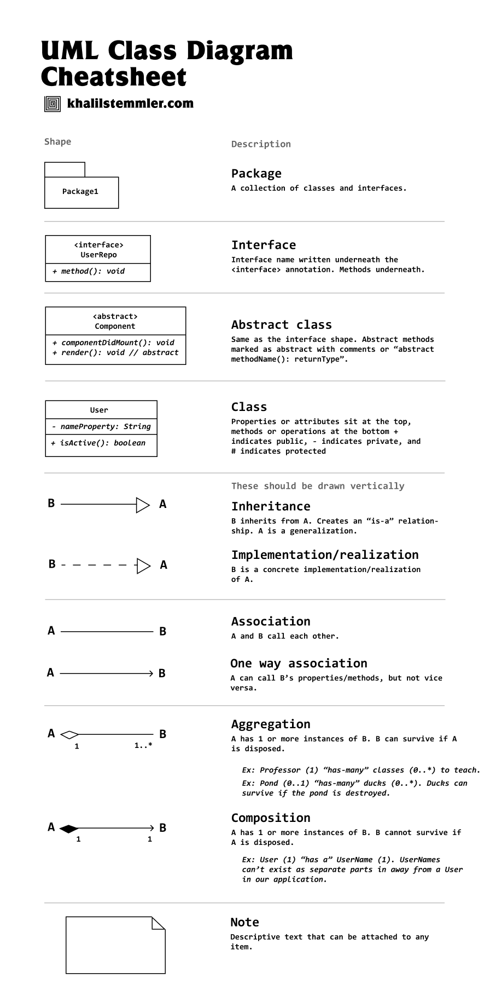

# Ultimate DEsign Patterns

this is summary of the course

# SOLID

very awesome guidline principles

## Single Responsibility principle

**_a class has only one reason to change_**

I personaly think this term is better than "A class only do one thing" because Design patterns's major advantage is to ease refactoring; so the term "_one reason to change_" comes from the fact that when I refactor I will only change that exact part

In case of violation; I will when refactoring I will have to change manythings because the class now manages alot of state and is very vulnerable to high coupling of methods even if they are separated

As long as many functionalities live within the class scope; it becomes violation, no matter if they are in separated methods or not

### TS example

this is violation

```ts
class UserService {
  createUser(name: string, email: string): void {
    console.log(`User ${name} created.`);

    this.sendEmail(email, "Welcome!", "Thank you for signing up!");
    this.logActivity(name, "User account created.");
  }

  private sendEmail(to: string, subject: string, body: string): void {
    console.log(`Sending email to ${to}: ${subject} - ${body}`);
  }

  private logActivity(user: string, action: string): void {
    console.log(`Logging activity: ${user} - ${action}`);
  }
}

const userService = new UserService();
userService.createUser("Alice", "alice@example.com");
```

this is application

```ts
class EmailService {
  sendEmail(to: string, subject: string, body: string): void {
    console.log(`Sending email to ${to}: ${subject} - ${body}`);
  }
}

class LoggerService {
  logActivity(user: string, action: string): void {
    console.log(`Logging activity: ${user} - ${action}`);
  }
}

class UserService {
  constructor(
    private emailService: EmailService,
    private loggerService: LoggerService
  ) {}

  createUser(name: string, email: string): void {
    console.log(`User ${name} created.`);

    this.emailService.sendEmail(email, "Welcome!", "Thank you for signing up!");
    this.loggerService.logActivity(name, "User account created.");
  }
}

// Usage
const emailService = new EmailService();
const loggerService = new LoggerService();
const userService = new UserService(emailService, loggerService);

userService.createUser("Alice", "alice@example.com");
```

## Open Closed principle

**_Open for adding; Closed for modifications_**

the Idea is: when we refactor the code, we don't need to refactor anything, we just add the desired functionaliy seamlessly

this is better demonstrated with an example

### example

the violation

```ts
class PaymentProcessor {
  processPayment(method: string, amount: number): void {
    if (method === "credit_card") {
      console.log(`Processing credit card payment of $${amount}`);
    } else if (method === "paypal") {
      console.log(`Processing PayPal payment of $${amount}`);
    } else {
      console.log("Unknown payment method");
    }
  }
}

// Usage
const processor = new PaymentProcessor();
processor.processPayment("credit_card", 100);
processor.processPayment("paypal", 50);
```

the application

```ts
interface PaymentMethod {
  process(amount: number): void;
}

class CreditCardPayment implements PaymentMethod {
  process(amount: number): void {
    console.log(`Processing credit card payment of $${amount}`);
  }
}

class PayPalPayment implements PaymentMethod {
  process(amount: number): void {
    console.log(`Processing PayPal payment of $${amount}`);
  }
}

// New payment method added without modifying existing code
class BitcoinPayment implements PaymentMethod {
  process(amount: number): void {
    console.log(`Processing Bitcoin payment of $${amount}`);
  }
}

class PaymentProcessor {
  processPayment(method: PaymentMethod, amount: number): void {
    method.process(amount);
  }
}

// Usage
const processor = new PaymentProcessor();

const creditCard = new CreditCardPayment();
const paypal = new PayPalPayment();
const bitcoin = new BitcoinPayment(); // New method added without modifying `PaymentProcessor`

processor.processPayment(creditCard, 100);
processor.processPayment(paypal, 50);
processor.processPayment(bitcoin, 200);
```

## Liskov substitution

**Parent class can Be replaced by Child class**

### examples

violation

```ts
class Bird {
  fly(): void {
    console.log("Flying...");
  }
}

class Sparrow extends Bird {}

class Penguin extends Bird {
  fly(): void {
    throw new Error("Penguins cannot fly!");
  }
}

// Usage
function makeBirdFly(bird: Bird) {
  bird.fly();
}

const sparrow = new Sparrow();
const penguin = new Penguin();

makeBirdFly(sparrow); //  Works fine
makeBirdFly(penguin); //  Throws an error: "Penguins cannot fly!"
```

application

```ts
class Bird {
  eat(): void {
    console.log("Eating...");
  }
}

class FlyingBird extends Bird {
  fly(): void {
    console.log("Flying...");
  }
}

class Sparrow extends FlyingBird {}

class Penguin extends Bird {
  swim(): void {
    console.log("Penguin is swimming.");
  }
}

// Usage
function makeBirdFly(bird: FlyingBird) {
  bird.fly();
}

const sparrow = new Sparrow();
const penguin = new Penguin();

makeBirdFly(sparrow); //  Works fine
// makeBirdFly(penguin);  Type error: Argument of type 'Penguin' is not assignable to parameter of type 'FlyingBird'.
```

## Interface segregation

**_Classes should not implement or use interfaces that has members that are not used_**

fixing this problem is by breaking the interface into smaller interfaces and only working with interfaces that makes sense

> also the term _Interface_ may be an abstract

### examples

violation

```ts
interface Worker {
  work(): void;
  takeBreak(): void;
}

class HumanWorker implements Worker {
  work(): void {
    console.log("Human is working...");
  }

  takeBreak(): void {
    console.log("Human is taking a break...");
  }
}

class RobotWorker implements Worker {
  work(): void {
    console.log("Robot is working...");
  }

  takeBreak(): void {
    throw new Error("Robots do not take breaks!");
  }
}

// Usage
const workers: Worker[] = [new HumanWorker(), new RobotWorker()];

workers.forEach((worker) => {
  worker.work();
  worker.takeBreak(); // Causes an error for RobotWorker
});
```

application

```ts
interface Workable {
  work(): void;
}

interface Breakable {
  takeBreak(): void;
}

class HumanWorker implements Workable, Breakable {
  work(): void {
    console.log("Human is working...");
  }

  takeBreak(): void {
    console.log("Human is taking a break...");
  }
}

class RobotWorker implements Workable {
  work(): void {
    console.log("Robot is working...");
  }
}

// Usage
const workers: Workable[] = [new HumanWorker(), new RobotWorker()];
workers.forEach((worker) => worker.work()); // No issue

const breakableWorkers: Breakable[] = [new HumanWorker()];
breakableWorkers.forEach((worker) => worker.takeBreak()); // Only humans take breaks
```

## Dependency inversion

**_High level (users) modules should not depend on the abstraction (implementation) but they should depend on the interface_**

then the _Low level modules_ are **injected** into the _High level modules_ and that is **Dependecy injection**

### examples

violation

```ts
class PayPalPayment {
  processPayment(amount: number): void {
    console.log(`Processing PayPal payment of $${amount}`);
  }
}

class OrderService {
  private paymentProcessor = new PayPalPayment(); // Direct dependency

  placeOrder(amount: number): void {
    console.log("Order placed.");
    this.paymentProcessor.processPayment(amount);
  }
}

// Usage
const orderService = new OrderService();
orderService.placeOrder(100);
```

application

```ts
interface PaymentProcessor {
  processPayment(amount: number): void;
}

class PayPalPayment implements PaymentProcessor {
  processPayment(amount: number): void {
    console.log(`Processing PayPal payment of $${amount}`);
  }
}

class CreditCardPayment implements PaymentProcessor {
  processPayment(amount: number): void {
    console.log(`Processing Credit Card payment of $${amount}`);
  }
}

class OrderService {
  constructor(private paymentProcessor: PaymentProcessor) {} // Inject dependency

  placeOrder(amount: number): void {
    console.log("Order placed.");
    this.paymentProcessor.processPayment(amount);
  }
}

// Usage
const paypal = new PayPalPayment();
const orderService1 = new OrderService(paypal);
orderService1.placeOrder(100);

const creditCard = new CreditCardPayment();
const orderService2 = new OrderService(creditCard);
orderService2.placeOrder(200);
```

# UML



# Observer

It is about having an **Observabls** (emailService) that notifies **Observers** (User) with events that the **Observers** has subscribed to

```ts
interface Observable {
  subscribe(observer: ObserverInterface, eventType: string): void;
  unSubscribe(observer: ObserverInterface, eventType: string): void;
  notify(event: EventInterface): void;
}
```

```ts
interface ObserverInterface {
  notify(event: EventInterface): void;
}
```

also who carries the events list is debatable

- If the Users carries the events then the EmailService will itirate over millions of users that could be not subscribing to any avents at all

- If the EmailService carries the events attached to lists of users then it will not itirate over millions of users but eventualy will carry millions of rours of users pointers and events

the approach of the course:
// v(image-1.png)

## Implementation

### defining interfaces

```ts
interface EventInterface {
  name: string;
  payload?: any; // Additional event data
}
```

```ts
interface ObservableInterface {
  attach(observer: ObserverInterface, eventType: string): void;
  detach(observer: ObserverInterface, eventType: string): void;
  notify(event: EventInterface): void;
}
```

```ts
interface ObserverInterface {
  update(event: EventInterface): void;
}
```

### defining classes

```ts
// Observer (User)
class User implements ObserverInterface {
  constructor(public name: string) {}

  update(event: EventInterface) {
    console.log(
      `User ${this.name} received notification: ${event.name}`,
      event.payload
    );
  }
}
```

```ts
// Notification Service with Event-Based Subscription Management
class NotificationService implements ObservableInterface {
  private observers: Map<string, Set<ObserverInterface>> = new Map();

  attach(observer: ObserverInterface, eventType: string) {
    if (!this.observers.has(eventType)) {
      this.observers.set(eventType, new Set());
    }
    this.observers.get(eventType)!.add(observer);
    console.log(
      `${(observer as User).name} subscribed to ${eventType} notifications.`
    );
  }

  detach(observer: ObserverInterface, eventType: string) {
    if (this.observers.has(eventType)) {
      this.observers.get(eventType)!.delete(observer);
      console.log(
        `${
          (observer as User).name
        } unsubscribed from ${eventType} notifications.`
      );
      if (this.observers.get(eventType)!.size === 0) {
        this.observers.delete(eventType);
      }
    }
  }

  notify(event: EventInterface) {
    if (this.observers.has(event.name)) {
      this.observers
        .get(event.name)!
        .forEach((observer) => observer.update(event));
    }
  }
}
```

```ts
// User Service (Handles user subscriptions and unsubscriptions)
class UserService {
  private users: User[] = [];

  constructor(private notificationService: NotificationService) {}

  createUser(name: string): User {
    const user = new User(name);
    this.users.push(user);
    return user;
  }

  subscribeUserToEvent(user: User, eventType: string) {
    this.notificationService.attach(user, eventType);
  }

  unsubscribeUserFromEvent(user: User, eventType: string) {
    this.notificationService.detach(user, eventType);
  }
}
```

```ts
// Email Service (Triggers email-related events)
class EmailService {
  constructor(private notificationService: NotificationService) {}

  sendEmail(emailContent: string) {
    this.notificationService.notify({ name: "email", payload: emailContent });
  }
}
```

```ts
// SMS Service (Another example observer service)
class SMSService {
  constructor(private notificationService: NotificationService) {}

  sendSMS(smsContent: string) {
    this.notificationService.notify({ name: "sms", payload: smsContent });
  }
}
```

usage

```ts
const notificationService = new NotificationService();
const userService = new UserService(notificationService);
const emailService = new EmailService(notificationService);
const smsService = new SMSService(notificationService);

// Creating Users
const user1 = userService.createUser("Alice");
const user2 = userService.createUser("Bob");

// Subscribing Users to Specific Events
userService.subscribeUserToEvent(user1, "email");
userService.subscribeUserToEvent(user2, "sms");

// Sending Notifications
emailService.sendEmail("New promotional email!");
smsService.sendSMS("Flash Sale: 50% off!");

// Unsubscribing Bob from SMS notifications
userService.unsubscribeUserFromEvent(user2, "sms");

// Sending More Notifications
emailService.sendEmail("Exclusive email offer!");
smsService.sendSMS("New SMS campaign launched!");
```

# Strategy

If a class has a composition relatioship with an interface, instead of linking them with hard coding, we can inject the implementation

it is exactly what we did in the DI pronciple

// v(image-2.png)

we can have unlimited implementation of the same strategy

## Implementaion

Defines a common interface for different pricing strategies.

```typescript
interface PricingStrategy {
  calculatePrice(price: number): number;
}
```

Different pricing strategies implementing `PricingStrategy`.

```typescript
class RegularPricingStrategy implements PricingStrategy {
  calculatePrice(price: number): number {
    return price; // No discount
  }
}

class GoldPricingStrategy implements PricingStrategy {
  calculatePrice(price: number): number {
    return price * 0.9; // 10% discount
  }
}

class PremiumPricingStrategy implements PricingStrategy {
  calculatePrice(price: number): number {
    return price * 0.8; // 20% discount
  }
}
```

Represents a product that uses a pricing strategy to determine its final price.

```typescript
class Product {
  constructor(
    public name: string,
    public price: number,
    private pricingStrategy: PricingStrategy
  ) {}

  calculatePrice(): number {
    return this.pricingStrategy.calculatePrice(this.price);
  }
}
```

Defines a common interface for different payment strategies.

```typescript
interface PaymentStrategy {
  processPayment(amount: number): void;
}
```

Different payment strategies implementing `PaymentStrategy`.

```typescript
class VisaCardPaymentStrategy implements PaymentStrategy {
  processPayment(amount: number): void {
    console.log(`Processing Visa Card payment of $${amount}`);
  }
}

class PaypalPaymentStrategy implements PaymentStrategy {
  processPayment(amount: number): void {
    console.log(`Processing PayPal payment of $${amount}`);
  }
}

class BankTransferPaymentStrategy implements PaymentStrategy {
  processPayment(amount: number): void {
    console.log(`Processing Bank Transfer payment of $${amount}`);
  }
}
```

Handles payment processing using a selected payment strategy.

```typescript
class Checkout {
  constructor(private paymentStrategy: PaymentStrategy) {}

  processPayment(amount: number): void {
    this.paymentStrategy.processPayment(amount);
  }
}
```

Demonstrates how to use the strategies in action.

```typescript
// Create a product with a Gold pricing strategy
const product1 = new Product("Laptop", 1000, new GoldPricingStrategy());

// Calculate the final price
console.log(`Final Price: $${product1.calculatePrice()}`);

// Process payment using PayPal
const checkout = new Checkout(new PaypalPaymentStrategy());
checkout.processPayment(product1.calculatePrice());
```

# Template Method

The **Template Method** design pattern defines the **skeleton of an algorithm** in a base class but lets subclasses **override specific steps** without changing the algorithm's structure.

Here’s a **TypeScript implementation** using Markdown under `## Implementation`.

## Implementation

Defines the template method and the structure of the algorithm.

```typescript
abstract class OrderProcessor {
  // Template method (final method that defines the process)
  processOrder(): void {
    this.selectProduct();
    this.makePayment();
    this.deliverProduct();
  }

  abstract selectProduct(): void;
  abstract makePayment(): void;

  // Hook method (optional step with default implementation)
  deliverProduct(): void {
    console.log("Delivering product to customer...");
  }
}
```

Subclasses implement specific steps of the algorithm.

```typescript
class OnlineOrderProcessor extends OrderProcessor {
  selectProduct(): void {
    console.log("Selecting product from online store...");
  }

  makePayment(): void {
    console.log("Processing online payment...");
  }
}

class InStoreOrderProcessor extends OrderProcessor {
  selectProduct(): void {
    console.log("Selecting product from physical store...");
  }

  makePayment(): void {
    console.log("Processing cash or card payment...");
  }
}
```

usage

```typescript
const onlineOrder = new OnlineOrderProcessor();
console.log("Processing Online Order:");
onlineOrder.processOrder();

console.log("\nProcessing In-Store Order:");
const inStoreOrder = new InStoreOrderProcessor();
inStoreOrder.processOrder();
```

# Momento

a momento class manages previous and next state

**Think of iit like a _ctrl+z_ and _shift+ctrl+z_ buttons**

// v(image-5.png)

## Implementation

```typescript
class Memento {
  constructor(private state: string) {}

  getState(): string {
    return this.state;
  }
}
```

Creates and restores its state using Memento.

```typescript
class Originator {
  private state: string = "";

  setState(state: string): void {
    console.log(`Setting state to: ${state}`);
    this.state = state;
  }

  saveState(): Memento {
    console.log(`Saving state: ${this.state}`);
    return new Memento(this.state);
  }

  restoreState(memento: Memento): void {
    this.state = memento.getState();
    console.log(`Restored state to: ${this.state}`);
  }
}
```

Manages the saved states.

```typescript
class Caretaker {
  private mementos: Memento[] = [];

  saveMemento(memento: Memento): void {
    this.mementos.push(memento);
  }

  getMemento(index: number): Memento | null {
    return this.mementos[index] || null;
  }
}
```

```typescript
const originator = new Originator();
const caretaker = new Caretaker();

originator.setState("State 1");
caretaker.saveMemento(originator.saveState());

originator.setState("State 2");
caretaker.saveMemento(originator.saveState());

originator.setState("State 3");

console.log("\nRestoring previous state:");
const previousState = caretaker.getMemento(1);
if (previousState) originator.restoreState(previousState);

console.log("\nRestoring first saved state:");
const firstState = caretaker.getMemento(0);
if (firstState) originator.restoreState(firstState);
```

## Example implementation of the text editor

```typescript
class TextEditorState {
  constructor(private content: string) {}

  getContent(): string {
    return this.content;
  }
}
```

```typescript
class TextEditor {
  private content: string = "";

  setContent(content: string): void {
    this.content = content;
  }

  getContent(): string {
    return this.content;
  }

  save(): TextEditorState {
    return new TextEditorState(this.content);
  }

  restore(state: TextEditorState): void {
    this.content = state.getContent();
  }
}
```

```typescript
class History {
  private prevStates: TextEditorState[] = [];
  private nextStates: TextEditorState[] = [];

  saveHistoryState(state: TextEditorState): void {
    this.prevStates.push(state);
    this.nextStates = []; // Clear redo history when saving a new state
  }

  undo(): TextEditorState | null {
    if (this.prevStates.length === 0) return null;
    const lastState = this.prevStates.pop()!;
    this.nextStates.push(lastState);
    return lastState;
  }

  redo(): TextEditorState | null {
    if (this.nextStates.length === 0) return null;
    const nextState = this.nextStates.pop()!;
    this.prevStates.push(nextState);
    return nextState;
  }
}
```

usage

```typescript
const editor = new TextEditor();
const history = new History();

editor.setContent("Version 1");
history.saveHistoryState(editor.save());

editor.setContent("Version 2");
history.saveHistoryState(editor.save());

editor.setContent("Version 3");
history.saveHistoryState(editor.save());

console.log(`Current Content: ${editor.getContent()}`);

// Undo twice
const undoState1 = history.undo();
if (undoState1) editor.restore(undoState1);
console.log(`After Undo 1: ${editor.getContent()}`);

const undoState2 = history.undo();
if (undoState2) editor.restore(undoState2);
console.log(`After Undo 2: ${editor.getContent()}`);

// Redo once
const redoState = history.redo();
if (redoState) editor.restore(redoState);
console.log(`After Redo: ${editor.getContent()}`);
```

# Visitor

The idea of the Visitor pattern is to leave a space in the classes to accept 2nd party functionality

// v(image-6.png)

## Example

interfaces

```ts
// Visitor Interface
interface Visitor {
  visitCircle(circle: Circle): void;
  visitRectangle(rectangle: Rectangle): void;
}
```

```ts
// Element Interface
interface Shape {
  accept(visitor: Visitor): void;
}
```

our concrete elements

```ts
class Circle implements Shape {
  accept(visitor: Visitor): void {
    visitor.visitCircle(this);
  }
}
```

```ts
class Rectangle implements Shape {
  accept(visitor: Visitor): void {
    visitor.visitRectangle(this);
  }
}
```

### creating visitors

this is an example visitor that calculates area based on the **Public** members of the shape, we can make as many visitors as we can

```ts
class AreaCalculator implements Visitor {
  visitCircle(circle: Circle): void {
    console.log("Calculating area of Circle");
  }

  visitRectangle(rectangle: Rectangle): void {
    console.log("Calculating area of Rectangle");
  }
}
```

### usage

```ts
const visitor = new AreaCalculator();

const circle = new Circle();

circle.accept(visitor); // it logs: "Calculating area of Circle"
```

## My thoughts

I think this visitor pattern is not useful for many reasons

- **It needs to operate on internal attributes of the class** thus it breaks the core pronciples of OOP (encapsulation, abstraction) and makes the code not safe

- **It abstracts implementation** If I were too add more implementation; I would refactor the implementation rather than adding a new functionality blindly, this can lead to security vulnerability

maybe It can be a good pattern in case of have a very old legacy code that barely works

# Itirator

the idea of the itiratoe pattern is to separate itiration over objects logic

// v(image-7.png)

this is better demonstrated with an example

## Example

interfaces

```ts
interface Iterator<T> {
  next(): T | null;
  hasNext(): boolean;
}
```

```ts
interface IterableCollection<T> {
  getIterator(): Iterator<T>;
}
```

the itirator

```ts
class ArrayIterator<T> implements Iterator<T> {
  private index = 0;

  constructor(private items: T[]) {}

  next(): T | null {
    if (this.hasNext()) {
      return this.items[this.index++];
    }
    return null;
  }

  hasNext(): boolean {
    return this.index < this.items.length;
  }
}
```

the collection repo

```ts
class NumberCollection implements IterableCollection<number> {
  private numbers: number[];

  constructor(numbers: number[]) {
    this.numbers = numbers;
  }

  getIterator(): Iterator<number> {
    return new ArrayIterator(this.numbers);
  }
}
```

### Usage

```ts
const collection = new NumberCollection([10, 20, 30, 40]);
const iterator = collection.getIterator();

while (iterator.hasNext()) {
  console.log(iterator.next()); // Output: 10, 20, 30, 40
}
```

# Chain of Responsibility (middlewares)

it is having multiple handlers for the same input in chain

// v(image-8.png)

## Example

```ts
abstract class Logger {
  // the class is abstract
  protected next: Logger | null = null; // the next logger, it may exist meaning that there is a next function or may not exist meaning that we are at the last middleware

  setNext(logger: Logger): Logger {
    // this sets up the next middleware chained to the existing middleware
    this.next = logger;
    return logger; // returns the new one
  }

  log(level: string, message: string): void {
    if (this.next) {
      // this is the logging functionality
      this.next.log(level, message);
    }
  }
}
```

### middlewares

these are three middlewares

```ts
class InfoLogger extends Logger {
  log(level: string, message: string): void {
    if (level === "INFO") {
      console.log(`[INFO]: ${message}`);
    } else {
      super.log(level, message);
    }
  }
}

class WarningLogger extends Logger {
  log(level: string, message: string): void {
    if (level === "WARNING") {
      console.log(`[WARNING]: ${message}`);
    } else {
      super.log(level, message);
    }
  }
}

class ErrorLogger extends Logger {
  log(level: string, message: string): void {
    if (level === "ERROR") {
      console.log(`[ERROR]: ${message}`);
    } else {
      super.log(level, message);
    }
  }
}
```

### Usage

creating classes

```ts
const infoLogger = new InfoLogger();
const warningLogger = new WarningLogger();
const errorLogger = new ErrorLogger();
```

injecting middlewares

```ts
infoLogger.setNext(warningLogger).setNext(errorLogger);
```

```ts
// Client makes requests
infoLogger.log("INFO", "This is an information message.");
infoLogger.log("WARNING", "This is a warning message.");
infoLogger.log("ERROR", "This is an error message.");
```

this code will loop over all the middleware and only the crosponding one will executee

# State

instead of changing implementation bassed on state; bind the implementation to the stat

// v(image-9.png)

this is better demonstrated woth an example

## Example

interfaces

```ts
// State Interface
interface OrderState {
  processOrder(): void;
  shipOrder(): void;
  deliverOrder(): void;
  cancelOrder(): void;
}
```

order manager

```ts
// Context Class (Order Management)
class OrderManagement {
  private orderState: OrderState;

  constructor() {
    this.orderState = new NewOrderState(this); // Default state
  }

  changeState(state: OrderState) {
    this.orderState = state;
  }

  processOrder() {
    this.orderState.processOrder();
  }

  shipOrder() {
    this.orderState.shipOrder();
  }

  deliverOrder() {
    this.orderState.deliverOrder();
  }

  cancelOrder() {
    this.orderState.cancelOrder();
  }
}
```

order states

```ts
// Concrete State: New Order
class NewOrderState implements OrderState {
  private orderManagement: OrderManagement;

  constructor(orderManagement: OrderManagement) {
    this.orderManagement = orderManagement;
  }

  processOrder() {
    console.log("Order is now being processed.");
    this.orderManagement.changeState(
      new ProcessingOrderState(this.orderManagement)
    );
  }

  shipOrder() {
    console.log("Cannot ship order. Order is still new.");
  }

  deliverOrder() {
    console.log("Cannot deliver order. Order is still new.");
  }

  cancelOrder() {
    console.log("Order is cancelled.");
    this.orderManagement.changeState(new CancelledOrderState());
  }
}

// Concrete State: Processing Order
class ProcessingOrderState implements OrderState {
  private orderManagement: OrderManagement;

  constructor(orderManagement: OrderManagement) {
    this.orderManagement = orderManagement;
  }

  processOrder() {
    console.log("Order is already being processed.");
  }

  shipOrder() {
    console.log("Order is now shipped.");
    this.orderManagement.changeState(
      new ShippedOrderState(this.orderManagement)
    );
  }

  deliverOrder() {
    console.log("Cannot deliver order before shipping.");
  }

  cancelOrder() {
    console.log("Order is cancelled.");
    this.orderManagement.changeState(new CancelledOrderState());
  }
}

// Concrete State: Shipped Order
class ShippedOrderState implements OrderState {
  private orderManagement: OrderManagement;

  constructor(orderManagement: OrderManagement) {
    this.orderManagement = orderManagement;
  }

  processOrder() {
    console.log("Order has already been shipped and cannot be processed.");
  }

  shipOrder() {
    console.log("Order is already shipped.");
  }

  deliverOrder() {
    console.log("Order has been delivered.");
    this.orderManagement.changeState(new DeliveredOrderState());
  }

  cancelOrder() {
    console.log("Cannot cancel. Order has already been shipped.");
  }
}

// Concrete State: Delivered Order
class DeliveredOrderState implements OrderState {
  deliverOrder() {
    console.log("Order is already delivered.");
  }

  processOrder() {
    console.log("Order is already delivered and cannot be processed.");
  }

  shipOrder() {
    console.log("Order is already delivered and cannot be shipped.");
  }

  cancelOrder() {
    console.log("Cannot cancel. Order is already delivered.");
  }
}

// Concrete State: Cancelled Order
class CancelledOrderState implements OrderState {
  deliverOrder() {
    console.log("Cannot deliver. Order is cancelled.");
  }

  processOrder() {
    console.log("Cannot process. Order is cancelled.");
  }

  shipOrder() {
    console.log("Cannot ship. Order is cancelled.");
  }

  cancelOrder() {
    console.log("Order is already cancelled.");
  }
}
```

### usage

```ts
const order = new OrderManagement();
order.processOrder(); // Transitions to Processing
order.shipOrder(); // Transitions to Shipped
order.deliverOrder(); // Transitions to Delivered
order.cancelOrder(); // Order cannot be cancelled after delivery
```

# Mediator

the Mediator is a class that do two things

- defines communication rules

- communicate classes

// v(image-11.png)

## Example

// v(image-12.png)

mediator interface

```ts
interface ChatMediator {
  sendDirectMessage(message: string, sender: User, receiver: User): void;
  sendGroupMessage(message: string, sender: User, groupName: string): void;
  registerUserToGroup(user: User, groupName: string): void;
}
```

mediator implementation

```ts
class ChatManagement implements ChatMediator {
  private groups: Map<string, User[]> = new Map();

  sendDirectMessage(message: string, sender: User, receiver: User): void {
    receiver.receiveDirectMessage(message, sender.getName());
  }

  sendGroupMessage(message: string, sender: User, groupName: string): void {
    const users = this.groups.get(groupName);
    if (!users) {
      console.log(`Group '${groupName}' does not exist.`);
      return;
    }

    users.forEach((user) => {
      if (user !== sender) {
        user.receiveGroupMessage(message, sender.getName(), groupName);
      }
    });
  }

  registerUserToGroup(user: User, groupName: string): void {
    if (!this.groups.has(groupName)) {
      this.groups.set(groupName, []);
    }
    this.groups.get(groupName)?.push(user);
  }
}
```

a user

```ts
class User {
  private name: string;
  private chatMediator: ChatMediator;

  constructor(name: string, chatMediator: ChatMediator) {
    this.name = name;
    this.chatMediator = chatMediator;
  }

  getName(): string {
    return this.name;
  }

  sendDirectMessage(message: string, receiver: User): void {
    console.log(
      `${this.name} sends direct message to ${receiver.getName()}: ${message}`
    );
    this.chatMediator.sendDirectMessage(message, this, receiver);
  }

  sendGroupMessage(message: string, groupName: string): void {
    console.log(
      `${this.name} sends message to group '${groupName}': ${message}`
    );
    this.chatMediator.sendGroupMessage(message, this, groupName);
  }

  receiveDirectMessage(message: string, sender: string): void {
    console.log(
      `${this.name} received direct message from ${sender}: ${message}`
    );
  }

  receiveGroupMessage(
    message: string,
    sender: string,
    groupName: string
  ): void {
    console.log(
      `${this.name} received group message in '${groupName}' from ${sender}: ${message}`
    );
  }
}
```

### usage

```ts
const chatMediator = new ChatManagement();

const user1 = new User("Alice", chatMediator);
const user2 = new User("Bob", chatMediator);
const user3 = new User("Charlie", chatMediator);

chatMediator.registerUserToGroup(user1, "Developers");
chatMediator.registerUserToGroup(user2, "Developers");
chatMediator.registerUserToGroup(user3, "Developers");

user1.sendDirectMessage("Hello Bob!", user2);
user2.sendGroupMessage("Hey team!", "Developers");
```

# Command

Instead of hardcoding commands and composing them manually, we can create a single entry point called **Command** that follows the same interface and executes multiple actions dynamically.

// v(image-13.png)

This is better demonstrated with an example.

## Example

### Command Interface

```ts
interface Command {
  execute(): void;
}
```

### Concrete Devices

```ts
class Light {
  turnOn() {
    console.log("Light is turned ON");
  }

  turnOff() {
    console.log("Light is turned OFF");
  }
}

class Tv {
  turnOn() {
    console.log("TV is turned ON");
  }

  turnOff() {
    console.log("TV is turned OFF");
  }
}

class Door {
  lock() {
    console.log("Door is LOCKED");
  }

  unlock() {
    console.log("Door is UNLOCKED");
  }
}
```

### Commands That Run the Concrete Devices

```ts
class TurnOnLightCommand implements Command {
  constructor(private light: Light) {}

  execute(): void {
    this.light.turnOn();
  }
}

class TurnOffLightCommand implements Command {
  constructor(private light: Light) {}

  execute(): void {
    this.light.turnOff();
  }
}

class TurnOnTvCommand implements Command {
  constructor(private tv: Tv) {}

  execute(): void {
    this.tv.turnOn();
  }
}

class TurnOffTvCommand implements Command {
  constructor(private tv: Tv) {}

  execute(): void {
    this.tv.turnOff();
  }
}

class LockDoorCommand implements Command {
  constructor(private door: Door) {}

  execute(): void {
    this.door.lock();
  }
}

class UnlockDoorCommand implements Command {
  constructor(private door: Door) {}

  execute(): void {
    this.door.unlock();
  }
}
```

### Class That Invokes Commands

```ts
class SmartHomeVoiceAssistant {
  private commands: Map<string, Command> = new Map();

  setCommand(name: string, command: Command) {
    this.commands.set(name, command);
  }

  say(commandName: string) {
    const command = this.commands.get(commandName);
    if (command) {
      console.log(`Voice Assistant executing: ${commandName}`);
      command.execute();
    } else {
      console.log(`Command "${commandName}" not found`);
    }
  }
}
```

### Mobile Application That Executes Commands

```ts
class SmartHomeMobileApplication {
  execute(command: Command) {
    console.log("Mobile App executing command...");
    command.execute();
  }
}
```

## Usage

### Create Commands and Device Classes

```ts
const light = new Light();
const tv = new Tv();
const door = new Door();

const turnOnLight = new TurnOnLightCommand(light);
const turnOffLight = new TurnOffLightCommand(light);
const turnOnTv = new TurnOnTvCommand(tv);
const turnOffTv = new TurnOffTvCommand(tv);
const lockDoor = new LockDoorCommand(door);
const unlockDoor = new UnlockDoorCommand(door);
```

### Inject Commands into Executors

```ts
const voiceAssistant = new SmartHomeVoiceAssistant();
voiceAssistant.setCommand("turn on light", turnOnLight);
voiceAssistant.setCommand("turn off light", turnOffLight);
voiceAssistant.setCommand("lock door", lockDoor);
voiceAssistant.setCommand("unlock door", unlockDoor);
```

### Mobile App That Can Execute Any Command

```ts
const mobileApp = new SmartHomeMobileApplication();
```

## Execution

```ts
voiceAssistant.say("turn on light");
mobileApp.execute(lockDoor);
```

# Adapter

an adapter allows communication between legacy code and new code that hase unmatching interface

an example would be

## Example

### legacy code

```ts
interface PaymentMethodAInterface {
  pay(amount: number): void;
}

class ProcessPayment {
  constructor(
    private amount: number,
    private paymentMethod: PaymentMethodAInterface
  ) {}

  processPayment(): void {
    this.paymentMethod.pay(this.amount);
  }
}
```

this legacy code works fine but what if I want to use another payment method with yet diffirent interface, I will have to refactor thwe `ProcessPayment` class

```ts
interface PaymentMethodBInterface {
  pay(amount: string): Promise<void>;
}
```

### new code

using an adapter will fix it

```ts
class PaymentMethodBAdapter implements PaymentMethodAInterface {
  constructor(private paymentMethodB: PaymentMethodBInterface) {}

  pay(amount: number): void {
    this.paymentMethodB.pay(amount.toString()).then(() => {
      console.log("Payment processed successfully");
    });
  }
}
```

# Bridge

in very simple words without BS, the Bridge pattern is just that we want the classes to depend on interface not implementation, thats it, nothing more

// v(image-15.png)

# Composite

treat individual objects and compositions of objects uniformly

## Example

the folder and the leaf has the same interface, which facilated getting reports about a single file (that has size ) and many files (through the size of the folder which is actually addition of all sizes), we can also make compositions of composition

interfaces

```ts
// Component
interface FileSystem {
  getSize(): number;
}
```

```ts
// Leaf
class File implements FileSystem {
  constructor(private size: number) {}

  getSize(): number {
    return this.size;
  }
}
```

the composing

```ts
// Composite
class Folder implements FileSystem {
  private children: FileSystem[] = [];

  add(child: FileSystem): void {
    this.children.push(child);
  }

  getSize(): number {
    return this.children.reduce((sum, child) => sum + child.getSize(), 0);
  }
}
```

### application

```ts
const file1 = new File(10);
const file2 = new File(20);
const folder = new Folder();
folder.add(file1);
folder.add(file2);

const file3 = new File(10);
const file4 = new File(20);
const folder2 = new Folder();
folder2.add(file3);
folder2.add(file4);

const folder3 = new Folder();
folder3.add(folder);
folder3.add(folder2);

// we can also add folders to folders
```

# Decorator

a decorator adds functionality to methods without touching them

## Example using basic syntax

```ts
// Component interface
interface Coffee {
  cost(): number;
  description(): string;
}

// Concrete component
class SimpleCoffee implements Coffee {
  cost(): number {
    return 5;
  }

  description(): string {
    return "Simple Coffee";
  }
}

// Decorator abstract class (implements Coffee interface)
class CoffeeDecorator implements Coffee {
  protected coffee: Coffee;

  constructor(coffee: Coffee) {
    this.coffee = coffee;
  }

  cost(): number {
    return this.coffee.cost();
  }

  description(): string {
    return this.coffee.description();
  }
}

// Concrete decorator
class MilkDecorator extends CoffeeDecorator {
  cost(): number {
    return this.coffee.cost() + 2;
  }

  description(): string {
    return this.coffee.description() + " with Milk";
  }
}

// Another concrete decorator
class SugarDecorator extends CoffeeDecorator {
  cost(): number {
    return this.coffee.cost() + 1;
  }

  description(): string {
    return this.coffee.description() + " with Sugar";
  }
}

// Usage
let coffee: Coffee = new SimpleCoffee();
console.log(coffee.description() + " costs $" + coffee.cost());

coffee = new MilkDecorator(coffee);
console.log(coffee.description() + " costs $" + coffee.cost());

coffee = new SugarDecorator(coffee);
console.log(coffee.description() + " costs $" + coffee.cost());
```

## Example using Method decorators

```ts
// Base class for coffee
class Coffee {
  cost(): number {
    return 5;
  }

  description(): string {
    return "Simple Coffee";
  }
}

// Method decorator to add Milk
function MilkDecorator(
  target: any,
  propertyKey: string,
  descriptor: PropertyDescriptor
) {
  const originalMethod = descriptor.value;

  descriptor.value = function (...args: any[]) {
    return originalMethod.apply(this, args) + " with Milk";
  };
}

// Method decorator to add Sugar
function SugarDecorator(
  target: any,
  propertyKey: string,
  descriptor: PropertyDescriptor
) {
  const originalMethod = descriptor.value;

  descriptor.value = function (...args: any[]) {
    return originalMethod.apply(this, args) + " with Sugar";
  };
}

// New class that uses decorators on methods
class DecoratedCoffee extends Coffee {
  @MilkDecorator
  description(): string {
    return super.description();
  }

  @SugarDecorator
  descriptionWithSugar(): string {
    return super.description();
  }
}
// Usage
let coffee = new Coffee();
console.log(coffee.description() + " costs $" + coffee.cost());

let decoratedCoffee = new DecoratedCoffee();
console.log(
  decoratedCoffee.description() + " costs $" + decoratedCoffee.cost()
);
```

# Facade

a facade is a single entry point that abstracts alot of implementation details behind a single function call

## Example

Without a facade, turning on a home theater might involve multiple steps:

```typescript
class Amplifier {
  on() {
    console.log("Amplifier is ON");
  }
  setVolume(level: number) {
    console.log(`Volume set to ${level}`);
  }
}

class DVDPlayer {
  on() {
    console.log("DVD Player is ON");
  }
  play(movie: string) {
    console.log(`Playing movie: ${movie}`);
  }
}

class Projector {
  on() {
    console.log("Projector is ON");
  }
  setInput(source: string) {
    console.log(`Projector input set to ${source}`);
  }
}
```

Now, using a **Facade**, we can simplify the process:

```typescript
class HomeTheaterFacade {
  private amp: Amplifier;
  private dvd: DVDPlayer;
  private projector: Projector;

  constructor(amp: Amplifier, dvd: DVDPlayer, projector: Projector) {
    this.amp = amp;
    this.dvd = dvd;
    this.projector = projector;
  }

  watchMovie(movie: string) {
    console.log("Setting up home theater...");
    this.amp.on();
    this.amp.setVolume(10);
    this.projector.on();
    this.projector.setInput("DVD");
    this.dvd.on();
    this.dvd.play(movie);
    console.log("Enjoy your movie!");
  }
}

// Usage
const homeTheater = new HomeTheaterFacade(
  new Amplifier(),
  new DVDPlayer(),
  new Projector()
);
homeTheater.watchMovie("Inception");
```

# Proxy

a proxy is a middleman that handles communication between two users and interfaces, so it can apply inputs modification/validation, routing, logging and more

# Flyweight

Imagine a game with thousands of trees. Instead of creating separate objects for each tree, we share the common tree type (shape, texture, color) and only store unique details like position.

## Example

```ts
// Shared tree type (intrinsic state)
class TreeType {
  constructor(
    public name: string,
    public color: string,
    public texture: string
  ) {}

  display(x: number, y: number) {
    console.log(
      `Displaying ${this.name} tree at (${x}, ${y}) with color ${this.color}`
    );
  }
}

// Flyweight Factory to manage shared tree types
class TreeFactory {
  private static treeTypes: Map<string, TreeType> = new Map();

  static getTreeType(name: string, color: string, texture: string): TreeType {
    const key = `${name}_${color}_${texture}`;
    if (!this.treeTypes.has(key)) {
      this.treeTypes.set(key, new TreeType(name, color, texture));
    }
    return this.treeTypes.get(key)!;
  }
}

// Tree object with extrinsic state (position)
class Tree {
  constructor(private x: number, private y: number, private type: TreeType) {}

  display() {
    this.type.display(this.x, this.y);
  }
}

// Usage
const forest: Tree[] = [];

forest.push(new Tree(10, 20, TreeFactory.getTreeType("Oak", "Green", "Rough")));
forest.push(new Tree(15, 25, TreeFactory.getTreeType("Oak", "Green", "Rough"))); // Shares same type
forest.push(
  new Tree(50, 60, TreeFactory.getTreeType("Pine", "Dark Green", "Smooth"))
);

forest.forEach((tree) => tree.display());
```

Here are the simple TypeScript examples for each design pattern:

---

# Singleton

Ensures that only one instance of a class exists and provides a global access point to it.

## Example

```ts
class Singleton {
  private static instance: Singleton;

  private constructor() {}

  static getInstance(): Singleton {
    if (!this.instance) {
      this.instance = new Singleton();
    }
    return this.instance;
  }
}

const s1 = Singleton.getInstance();
const s2 = Singleton.getInstance();
console.log(s1 === s2); // true
```

---

# Factory

Provides a method to create objects without specifying the exact class.

## Example

```ts
class Car {
  constructor(public model: string) {}
}

class CarFactory {
  static createCar(model: string): Car {
    return new Car(model);
  }
}

const car = CarFactory.createCar("Tesla");
console.log(car.model); // Tesla
```

---

# Abstract Factory

Creates families of related objects without specifying their concrete classes.

## Example

```ts
interface Button {
  render(): void;
}

class WindowsButton implements Button {
  render() {
    console.log("Windows Button");
  }
}

class MacOSButton implements Button {
  render() {
    console.log("MacOS Button");
  }
}

interface GUIFactory {
  createButton(): Button;
}

class WindowsFactory implements GUIFactory {
  createButton(): Button {
    return new WindowsButton();
  }
}

class MacOSFactory implements GUIFactory {
  createButton(): Button {
    return new MacOSButton();
  }
}

const factory: GUIFactory = new WindowsFactory();
const button = factory.createButton();
button.render(); // Windows Button
```

---

# Builder

Constructs complex objects step by step.

## Example

```ts
class Car {
  public engine?: string;
  public wheels?: number;
}

class CarBuilder {
  private car = new Car();

  setEngine(engine: string): this {
    this.car.engine = engine;
    return this;
  }

  setWheels(wheels: number): this {
    this.car.wheels = wheels;
    return this;
  }

  build(): Car {
    return this.car;
  }
}

const car = new CarBuilder().setEngine("V8").setWheels(4).build();
console.log(car);
```

# Prototype Pattern

The **Prototype Pattern** allows you to create new objects by copying an existing object (a prototype) instead of creating new instances from scratch. This is useful when object creation is expensive or complex.

## Example

```ts
interface Prototype {
  clone(): Prototype;
}

class Car implements Prototype {
  constructor(public model: string, public color: string) {}

  clone(): Car {
    return new Car(this.model, this.color);
  }
}

const car1 = new Car("Tesla", "Red");
const car2 = car1.clone(); // Creates a new object with the same properties

console.log(car1 === car2); // false (different objects)
console.log(car1.model === car2.model); // true
console.log(car1.color === car2.color); // true
```

This pattern is useful when you want to duplicate objects while preserving their existing structure and state.

# The End

thnks for reaching so far
